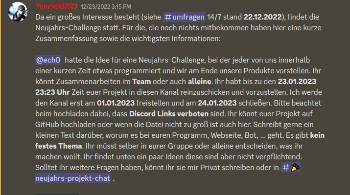

# DevCloud Neujahr Challenge

> Wichtig: Dieses Projekt funktioniert aktuell **nur** auf Linux, nicht auf Windows.

## Installation

1. `install.sh` herunterladen
2. skript ausführbar machen: `chmod +x install.sh`
3. skript ausführen: `./install.sh`
